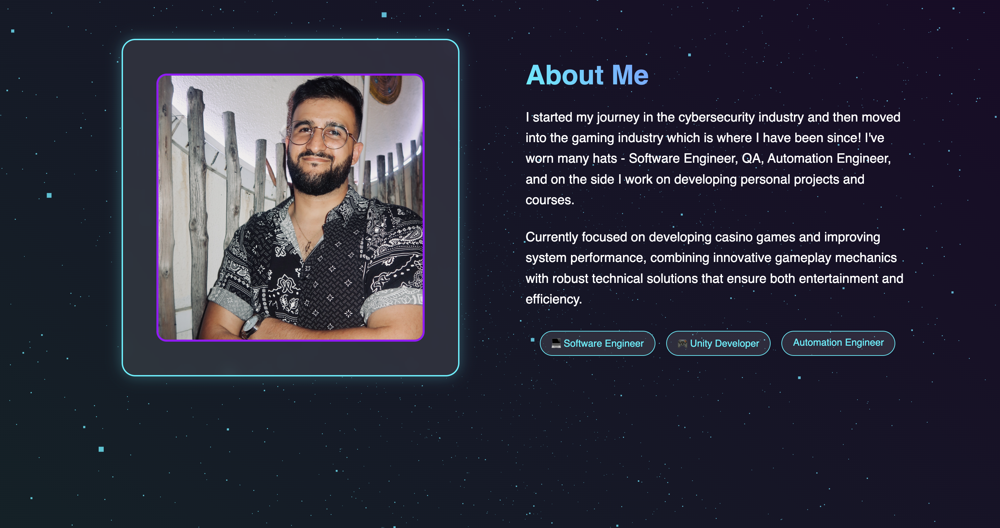

# Tomer Torgeman - Game Developer & Software Engineer Portfolio

Welcome to my portfolio repository! This website showcases my journey and projects as a Game Developer and Software Engineer.



## 🎮 Live Demo
[View Portfolio](https://your-portfolio-url.com)

## 🌟 Overview

A modern, interactive portfolio built with vanilla JavaScript and Three.js, featuring:
- Interactive 3D particle animations
- Project showcases with video demonstrations
- Dynamic skill progression visualization
- Interactive experience timeline
- Responsive design for all devices
- Integrated contact form

## 🛠️ Built With
- HTML5
- CSS3 (with modern features like Grid and Flexbox)
- JavaScript (ES6+)
- Three.js for 3D animations
- EmailJS for contact functionality

## 📂 Project Structure

portfolio/
├── assets/
│ ├── images/
│ ├── videos/
│ └── fonts/
├── css/
│ ├── components/
│ │ ├── hero.css
│ │ ├── profile.css
│ │ ├── projects.css
│ │ ├── experience.css
│ │ ├── skills.css
│ │ ├── contact.css
│ │ └── footer.css
│ ├── variables.css
│ ├── animations.css
│ └── main.css
├── js/
│ ├── components/
│ │ ├── hero.js
│ │ ├── projects.js
│ │ ├── skills.js
│ │ └── contact.js
│ └── main.js
└── index.html

Copy

## ⚙️ Setup and Installation

1. **Clone the repository**
   ```bash
   git clone https://github.com/ttomer/portfolio_website
   cd portfolio_website
Configure EmailJS
Create an account at EmailJS
Create a new email service
Update the EmailJS credentials in js/components/contact.js
Local Development
Open the project in your favorite code editor
Use a local development server (like Live Server in VS Code)
Navigate to localhost:your-port in your browser
📱 Responsive Design
The portfolio is fully responsive and tested across:

Desktop browsers (Chrome, Firefox, Safari)
Mobile devices (iOS, Android)
Tablets
Various screen sizes and orientations
🎯 Future Enhancements
 Add dark/light theme toggle
 Implement blog section
 Add project filtering system
 Integrate with GitHub API
 Add more interactive animations

📝 License
Distributed under the MIT License. See LICENSE for more information.

📧 Contact
Tomer Torgeman

LinkedIn: Tomer Torgeman
Portfolio: [portfolio](https://ttomer.github.io/portfolio_website/)
🙏 Acknowledgments
Three.js
EmailJS
Font Awesome for icons
